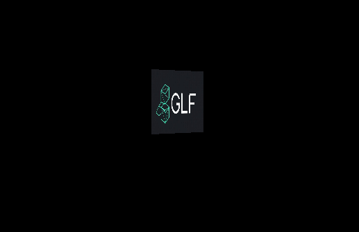
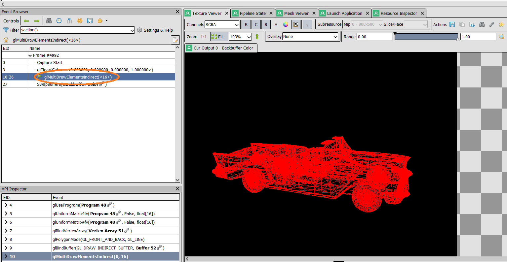
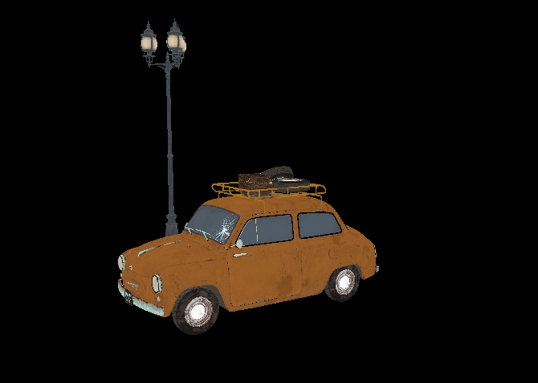

# GLF


Graphics Framework For Testing And Learning Computer Graphics Programming

## About

GLF is a simple, modern OpenGL framework designed for learning computer graphics. It provides clean abstractions over core OpenGL objects (Shaders, VAO, VBO) making it easier to focus on graphics concepts rather than boilerplate code.

### Features
- 🎨 Clean, intuitive API
- ⚡ Modern OpenGL 4.6 Core Profile
- 📚 Learning-focused design
- 🛠️ Easy to understand and extend

## Quick Start
```bash
# Clone and build
git clone https://github.com/KarimHamdallah/GLF.git
cd GLF && mkdir build && cd build
cmake .. && cmake --build .

# Run
./GLF
```

## Examples

### Hello Triangle


### Sprite 2D
- rotating sprite 2D in 3D world with 3D camera navigation


### 3D Model Loading
- Packs all meshes into a single vertex/index buffer to avoid per-mesh VAO binding overhead
- Uses Multi-Draw Indirect (MDI) to submit all draw commands in a single draw call
- Use Bindless Texture And Pass Them As ShaderStorageBuffer, And Using BaseInstance variable to hold TextureIndex For Each Mesh



### Hdri map Asset Converter (To Cubemap Faces)


**Made with ❤️ for learning graphics programming**