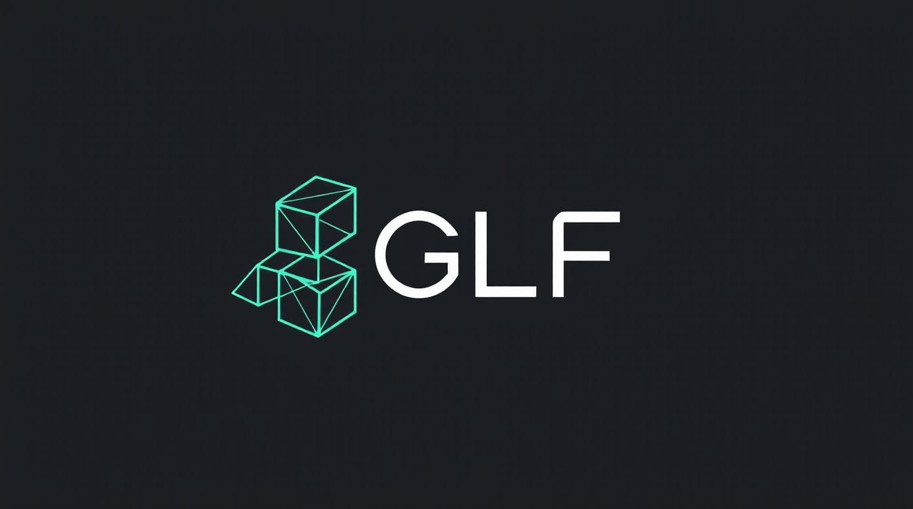
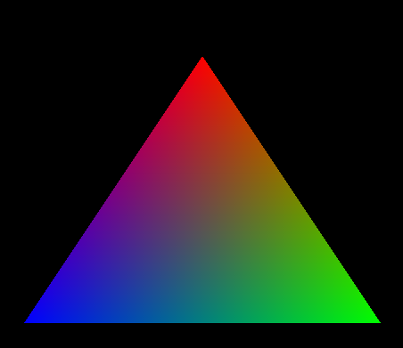
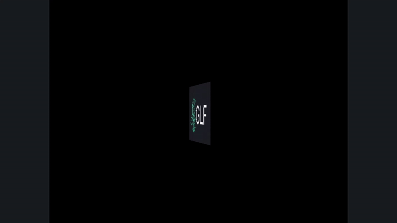

# GLF



Graphics Framework For Testing And Learning Computer Graphics Programming

## About

GLF is a simple, modern OpenGL framework designed for learning computer graphics. It provides clean abstractions over core OpenGL objects (Shaders, VAO, VBO) making it easier to focus on graphics concepts rather than boilerplate code.

### Features
- 🎨 Clean, intuitive API
- ⚡ Modern OpenGL 4.6 Core Profile
- 📚 Learning-focused design
- 🛠️ Easy to understand and extend

## Quick Start
```bash
# Clone and build
git clone https://github.com/KarimHamdallah/GLF.git
cd GLF && mkdir build && cd build
cmake .. && cmake --build .

# Run
./GLF
```

## Examples

### Hello Triangle





**Made with ❤️ for learning graphics programming**